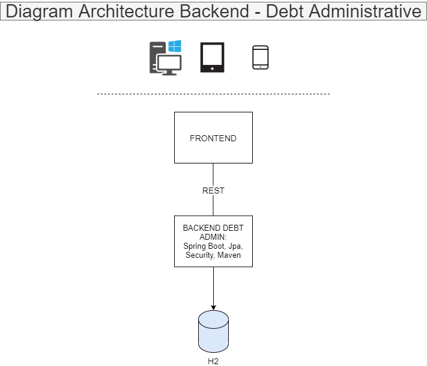
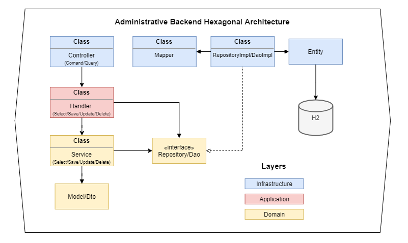

# Administrative Funds Transfers Challenge


All the project was made using:

* Hexagonal Architecture or Ports and Adapters
* Java 15
* Spring Boot 2.5.4
* Maven version 3.6.3
* H2 Database Engine
* IntelliJ IDEA IDE


## Prerequisites

* Install Java 15 or higher, download from this link [here](https://www.oracle.com/java/technologies/javase/jdk15-archive-downloads.html)
* Install Maven, download from this link [here](https://maven.apache.org/download.cgi). This article shows [how configure maven on Windows](https://www.mkyong.com/maven/how-to-install-maven-in-windows/).

## Setup

1) Download the project source code and unzip it. Open the project in your preferred IDE.


2) Create the configuration to run the SpringBoot project and create the environment variables:

```properties
FUNDTRANSFER_ACTIVE_PROFILE=dev
FUNDTRANSFER_SERVER_PORT=8089
FUNDTRANSFER_H2_URL=jdbc:h2:mem:debt
FUNDTRANSFER_H2_USERNAME=sa
FUNDTRANSFER_H2_PASSWORD=sa
# TODO: ADD OTHER PROPERTIE
```

## Run the project

1) Clean and install dependencies

```bash
cd fund-transfer
mvn clean install -U
```

2) Run the project as a jar:

```bash
cd fund-transfer/target
java -jar debt-${project.version}.jar
```
Or, as a Spring Boot Application with
```bash
mvn spring-boot:run
```
```bash
./mvnw spring-boot:run
```

## H2 Database

|Proyecto|URL|
|--------|---|
|H2|[http://localhost:8089/api/h2-console](http://localhost:8089/api/h2-console)|


## Swagger UI

|Proyecto|URL|
|--------|---|
|Debt|[http://localhost:8089/api/swagger-ui.html](http://localhost:8089/api/swagger-ui.html)|

## Diagrams Architecture
// TODO: Change images


